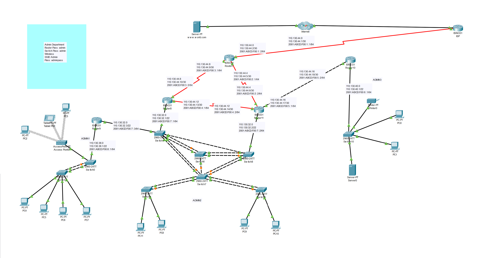

# Corporate Network Infrastructure Lab with VLANs and Inter-VLAN Routing


---

## 📖 Project Overview

This repository contains a meticulously configured Cisco Packet Tracer lab environment simulating a scalable and secure network infrastructure for a small-to-medium business (SMB). The project serves as a practical demonstration of fundamental network design and security principles, including network segmentation, dynamic IP address management, and Layer 2 security.

The core of this simulation is a **"Router-on-a-Stick"** topology, an efficient method for enabling communication between multiple Virtual LANs (VLANs) using a single router interface. This design is both cost-effective and a common real-world solution for segmenting networks in corporate environments.

## ✍️ Author

* **Md. Iqbal Haider Khan**
    * GitHub: [@ihkokil](https://github.com/ihkokil)
    * LinkedIn: [linkedin.com/in/ihkokil](https://www.linkedin.com/in/ihkokil/)

---

## 📋 Table of Contents
1. [Core Objectives](#-core-objectives)
2. [Network Topology](#-network-topology)
3. [Technologies Demonstrated](#-technologies-demonstrated)
4. [IP Addressing Architecture](#-ip-addressing-architecture)
5. [Configuration Highlights](#-configuration-highlights)
6. [Getting Started](#-getting-started)
7. [Validation & Testing](#-validation--testing)

---

## 🎯 Core Objectives

The design and configuration of this network were guided by the following technical objectives:

* **Implement Robust Network Segmentation:** Utilize VLANs to logically separate the network into distinct broadcast domains for different corporate departments (Sales, Marketing, HR, Management), enhancing security and network performance.
* **Establish Seamless Inter-VLAN Communication:** Configure a router to act as a central gateway, enabling controlled and efficient traffic routing between all VLANs.
* **Automate IP Address Management:** Deploy a centralized DHCP server on the router to dynamically assign IP addresses to endpoints, reducing administrative overhead and preventing IP conflicts.
* **Enforce Layer 2 Security:** Implement switch port security measures to mitigate unauthorized access by restricting port access to specific MAC addresses.

---

## 🌐 Network Topology

The network architecture consists of a central router, two distribution switches, and multiple end devices representing different departments.



---

## 💻 Technologies Demonstrated

This project showcases hands-on proficiency with the following networking technologies and concepts:

| Technology | Description |
| :--- | :--- |
| **VLANs (Virtual LANs)** | Logically segmenting the physical LAN into multiple broadcast domains to isolate traffic and improve security. |
| **802.1Q Encapsulation** | The IEEE standard for VLAN tagging. Used on the trunk link between the router and switch to identify which VLAN a frame belongs to. |
| **Inter-VLAN Routing** | Using a router with sub-interfaces (Router-on-a-Stick) to route packets between different VLANs. |
| **DHCP (Dynamic Host Configuration Protocol)** | Automating the assignment of IP addresses, subnet masks, default gateways, and DNS server information to client machines. |
| **Port Security** | A Layer 2 security feature that restricts input to an interface by limiting the MAC addresses that are allowed to send traffic into the port. |
| **Trunking (DTP)** | Configuring switch ports to carry traffic for multiple VLANs between switches and a router. |
| **Cisco IOS CLI** | The command-line interface used for configuring, managing, and troubleshooting Cisco networking devices. |

---

## 🏛️ IP Addressing Architecture

A structured IP addressing scheme was designed to support the VLAN architecture. Each VLAN operates on its own unique subnet.

| VLAN ID | Department  | Network Address      | Gateway IP (Router Sub-interface) | DHCP Range               |
|:--------|:------------|:-------------------|:----------------------------------|:-------------------------|
| 10      | Sales       | `192.168.10.0/24`  | `192.168.10.1`                    | `192.168.10.10 - .254`   |
| 20      | Marketing   | `192.168.20.0/24`  | `192.168.20.1`                    | `192.168.20.10 - .254`   |
| 30      | HR          | `192.168.30.0/24`  | `192.168.30.1`                    | `192.168.30.10 - .254`   |
| 99      | Management  | `192.168.99.0/24`  | `192.168.99.1`                    | `192.168.99.10 - .254`   |
| N/A     | Server      | `192.168.10.0/24`  | (Static) `192.168.10.100`         | N/A                      |


---

## ⚙️ Configuration Highlights

Below are key snippets from the device configurations that form the backbone of this network solution.

#### 1. Router-on-a-Stick Sub-interfaces (Router0)
Each sub-interface is configured with an IP address to serve as the default gateway for its respective VLAN and uses `encapsulation dot1q` to process tagged frames.
```cisco
! Interface for VLAN 10 (Sales)
interface GigabitEthernet0/0.10
 encapsulation dot1Q 10
 ip address 192.168.10.1 255.255.255.0

! Interface for VLAN 20 (Marketing)
interface GigabitEthernet0/0.20
 encapsulation dot1Q 20
 ip address 192.168.20.1 255.255.255.0

! Interface for VLAN 30 (HR)
interface GigabitEthernet0/0.30
 encapsulation dot1Q 30
 ip address 192.168.30.1 255.255.255.0
````

#### 2\. DHCP Pool Configuration (Router0)

DHCP pools are created for each VLAN to automate IP allocation. Note the excluded addresses for static assignments.

```cisco
! DHCP Pool for VLAN 10 (Sales)
ip dhcp excluded-address 192.168.10.1 192.168.10.9
ip dhcp excluded-address 192.168.10.100
!
ip dhcp pool VLAN10_SALES
 network 192.168.10.0 255.255.255.0
 default-router 192.168.10.1
```

#### 3\. Switch Trunk Port Configuration (Switch0)

The switch interface connected to the router is configured as a trunk to carry traffic for all VLANs.

```cisco
interface GigabitEthernet0/1
 switchport mode trunk
```

#### 4\. Switch Access Port & Security (Switch0)

Access ports are assigned to a single VLAN and secured with `port-security` to allow only the first learned MAC address, preventing unauthorized device connections.

```cisco
interface FastEthernet0/2
 switchport mode access
 switchport access vlan 10
 switchport port-security
 switchport port-security mac-address sticky
 switchport port-security violation shutdown
```

-----

## 🚀 Getting Started

To explore this lab environment:

1.  Ensure you have **Cisco Packet Tracer** (version 7.3 or higher recommended) installed.
2.  Clone this repository to your local machine:
    ```bash
    git clone https://github.com/ihkokil/Cisco-Packet-Tracer-VLAN-Routing-Lab.git
    ```
3.  Navigate to the project directory and open the `CISCO-Network.pkt` file.

-----

## ✅ Validation & Testing

You can confirm the network's functionality by executing the following commands from the Command Prompt of any PC within the simulation:

1.  **Verify DHCP Allocation:** Check if the PC has received a valid IP from its VLAN's subnet.

    ```bash
    ipconfig
    ```

2.  **Test Intra-VLAN Connectivity (Same Department):** Ping a device within the same VLAN. (e.g., PC0 in VLAN 10 to PC1 in VLAN 10)

    ```bash
    ping 192.168.10.11
    ```

3.  **Test Inter-VLAN Connectivity (Cross-Department):** Ping a device in a different VLAN. (e.g., PC0 in VLAN 10 to PC3 in VLAN 20)

    ```bash
    ping 192.168.20.10
    ```

    *(Note: The first ping may fail due to ARP resolution; subsequent pings should succeed).*

4.  **Test Connectivity to Server:** Ping the central server from any department.

    ```bash
    ping 192.168.10.100
    ```

A successful response to all these tests validates that the network segmentation, routing, and IP management are functioning correctly.